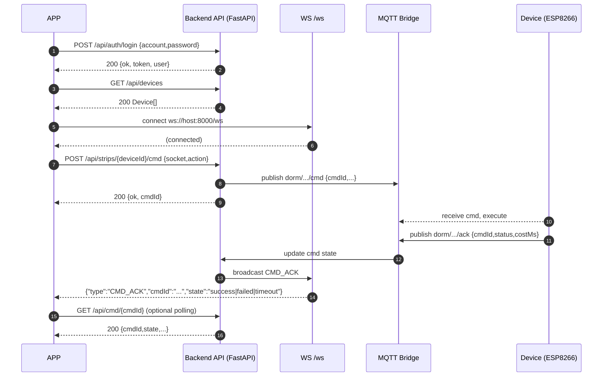
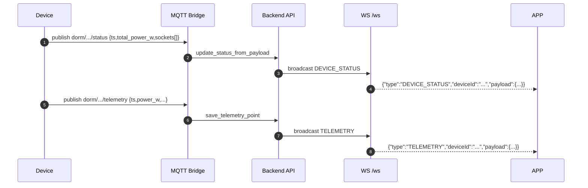
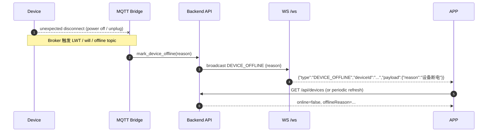

# APP 端接口时序图

本文档补充 APP 联调关键流程时序，覆盖：

- 登录
- 拉设备列表
- 订阅 WebSocket
- 下发命令
- ACK 回执闭环

---

## 1. 总流程（登录 -> 拉列表 -> WS -> 下发命令 -> ACK）

---

## 2. 设备状态与遥测实时更新

---

## 3. 离线流程（遗嘱触发）

---

## 4. APP 推荐实现策略

1. 登录成功后保存 `token`（当前后端返回 token，后续可扩展鉴权拦截）。
2. 首页先 `GET /api/devices` 拉首屏数据，再连 `/ws` 做增量更新。
3. 命令执行采用“双通道确认”：
   - 主通道：监听 `CMD_ACK` WebSocket 事件
   - 兜底：轮询 `GET /api/cmd/{cmdId}`
4. 设备离线后禁用控制按钮，并展示 `offlineReason`。
5. `deviceId` 含空格时必须 URL 编码（例如 `A-303 strip01` -> `A-303%20strip01`）。

